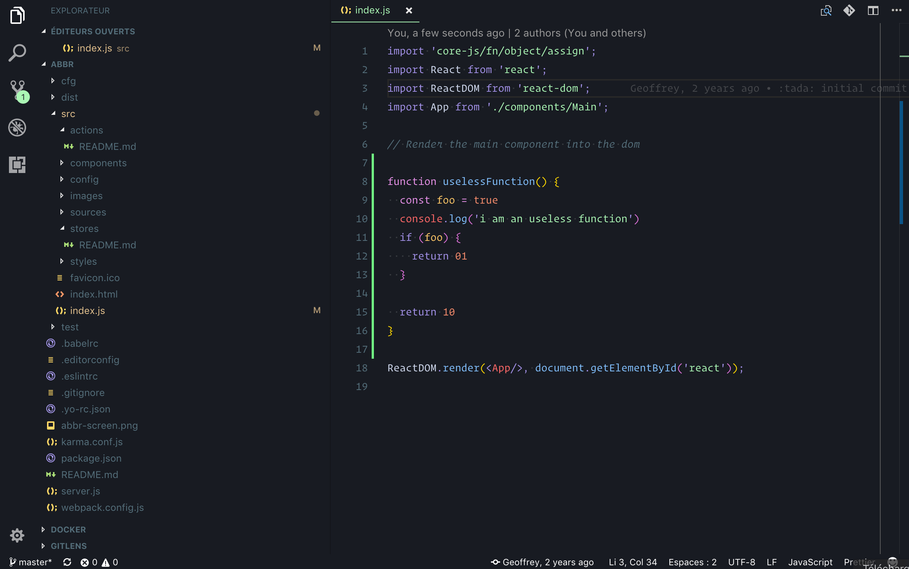
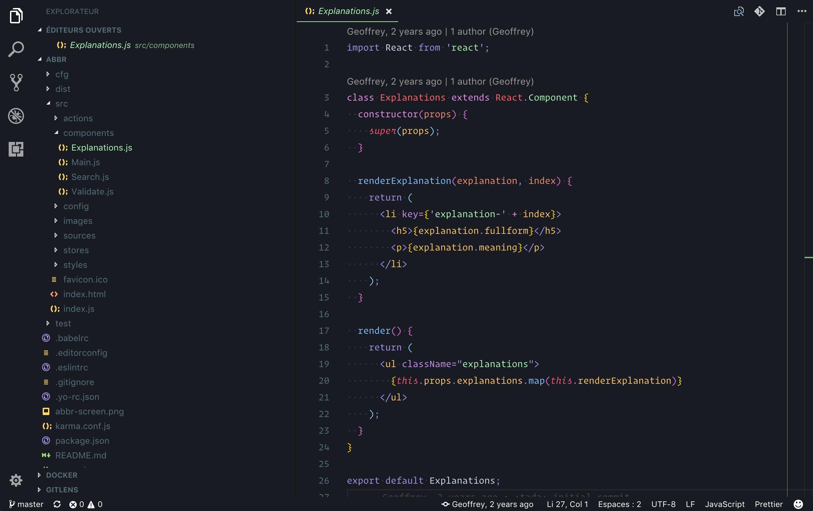
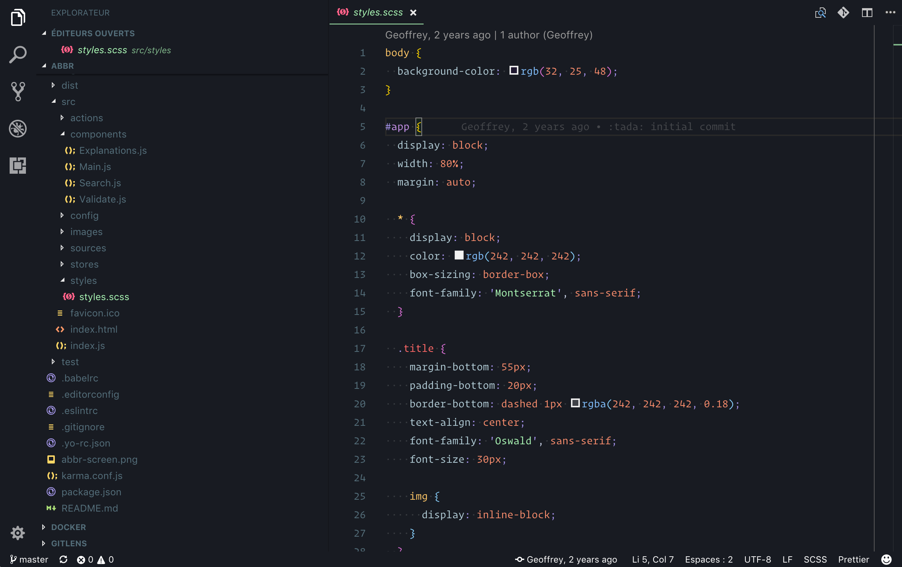

# Moon

## Overview
Moon is a dark theme with vivid color. Easy for the eyes with a lot of contrast.

## To know
⚠️ This is the first version, don't hesitate to give feedbacks to improve the theme.
Mainly designed for web languages, however it should works with other language.

## Demo

### JavaScript

### JSX

### SASS

## Contribute

Please feel free to fork, improve, make pull requests or fill issues.
I'll be glad to fix bugs you encountered or improve the theme.